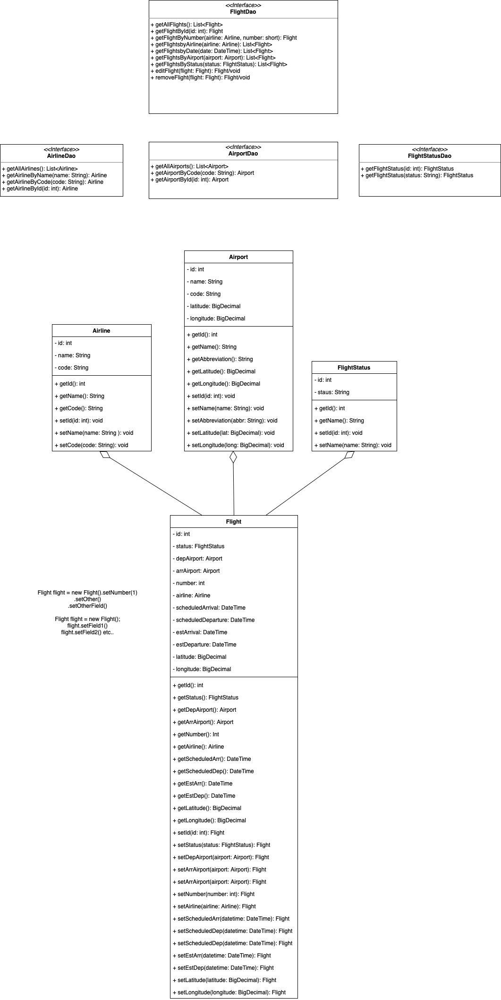

## Running the Application

### Start Flight Tracker Spring app
Run
```bash 
FlighttrackerApplication
```

### Start Frontend Svelte app
In ```frontend/flight-tracker```

Run
```bash
  npm i
  npm run dev
```

### View the app
```http://localhost:5173/```
    


